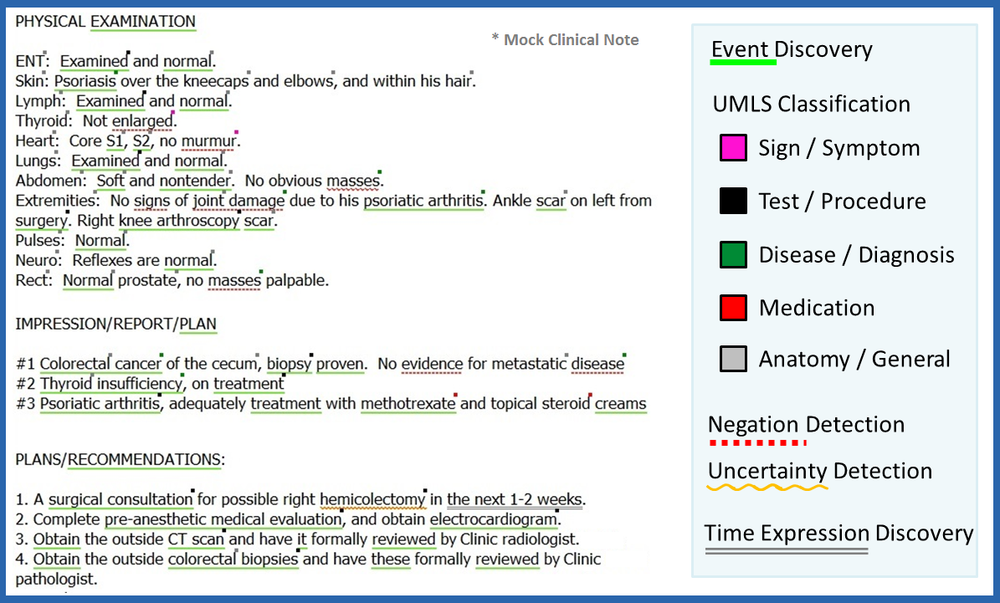
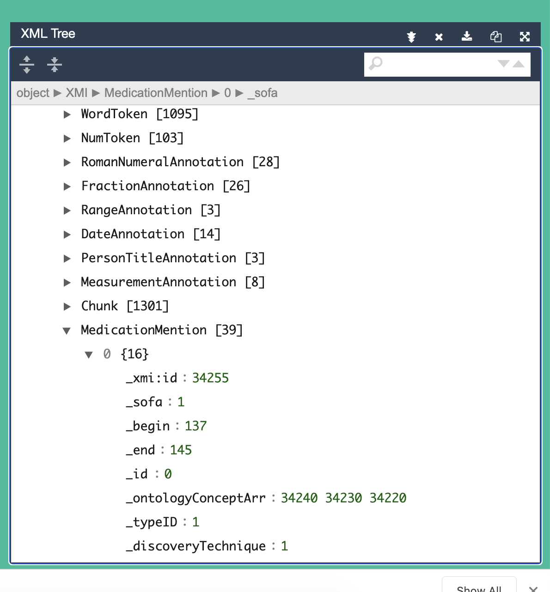

# cTAKES

This project aims to provide instructions for install and execute cTAKES. 
[Apache cTAKES](https://ctakes.apache.org/) is a natural language processing system for extraction of information from electronic medical record clinical free-text. cTAKES stands for clinical Text Analysis and Knowledge Extraction System. 

This image shows different types of nodes that cTakes can identify.




These types of nodes are defined in a dictionary [Unified Medical Language System (UMLS)](https://www.nlm.nih.gov/research/umls/index.html).     

## Extraction
It has different functionalities:   
- Entity recognition   
- Boundary detection     
- Tokenization    
- Normalization      
- Part-of-speech tagging     
- Extract entity properties (negated/subject)     

## cTAKES Terminology
- Pipeline: sequence of cTAKES annotators performing a comprehensive NLP task.    
- Analysis engine: A single cTAKES annotator used in a pipeline.    
- Piper file: A plaintext file describing a pipeline      
- CAS (Common Analysis Structure): This is the data structure through which the annotators in a pipeline communicate. 

The [Default Clinical Pipeline](https://cwiki.apache.org/confluence/display/CTAKES/Default+Clinical+Pipeline) produces the most commonly desired output from cTAKES. You only need to run a bash script, setting the input and output directories. 

You can create your own pipeline and edit the code of the componentes of the pipeline in order to improve the extraction according to your data or type of problem. 
 
## Running the docker container

**Create user** at [https://uts.nlm.nih.gov/license.html](https://uts.nlm.nih.gov/license.html) and copy the API key


**Build the container:**

```bash
   docker build --build-arg ctakes_key={KEY} --rm -t rootstrap/ctakes:latest .
```

**Run the container:**   

Run the container including the environment variables CTAKES_KEY, INPUT_DIR and OUTPUT_DIR a volume for the input files and a volume for the output files 

```bash
  docker run -ti --env CTAKES_KEY={KEY} --env INPUT_DIR=/input --env OUTPUT_DIR=/output -v $(pwd)/input:/input -v $(pwd)/output:/output rootstrap/ctakes:latest
```
The results files will be at output directory.  

## Example
You can use [XML Viewer](https://jsonformatter.org/xml-viewer) to inspect the result files. 



## Observation
- cTAKES can be downloaded from  [http://ctakes.apache.org/downloads.html](http://ctakes.apache.org/downloads.html)    
- The dictionaries can be downloaded from [http://ctakes.apache.org/downloads.html](http://ctakes.apache.org/downloads.html)      
